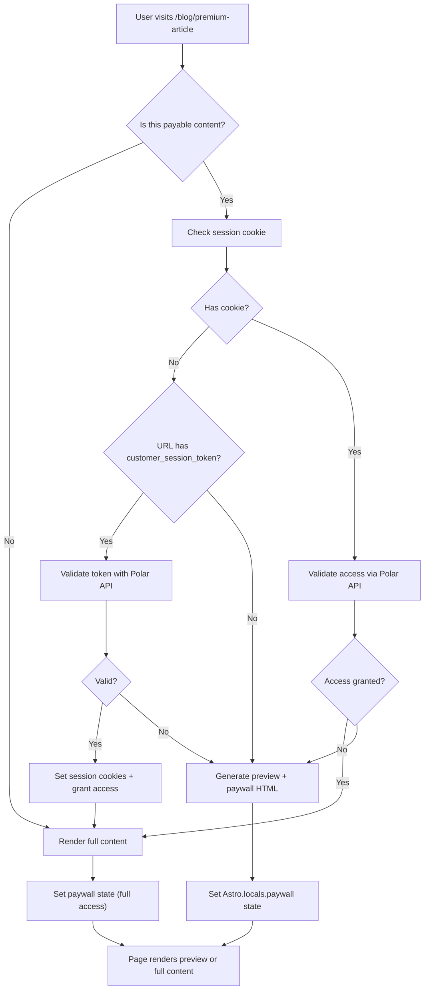

# MonaKiosk

Astro integration for monetizing content with [Polar.sh](https://polar.sh). Add paywalls, authentication, and checkout flows to your content with minimal setup.

## Features

- Injected API routes for auth, checkout, and portal
- Automatic payable content sync to Polar.sh at build time
- One-time & subscription pricing
- Downloadable files - Attach files to your paywalled content (PDFs, ZIPs, etc.)
- Paywall middleware
- Customizable defaults

### Support Us

You can check out our live paywalled post: [MonaKiosk + BetterAuth Integration Guide](https://www.mymona.xyz/blogs/2025-11/astro-paywall-with-monakiosk). It provides a detailed walkthrough on integrating MonaKiosk with BetterAuth and Polar — a valuable resource for advanced users.

If you’d like to support our work, consider purchasing the guide 😉.

Thank you in advance for your support!

## Installation

```bash
npm install mona-kiosk
```

## Quick Start

You can find the whole project in [demo](../demo/).

### 1. Setup Polar

In Polar, configure the environment values required by `.env`:

```env
POLAR_ACCESS_TOKEN=polar_oat_xxxxxxxxxxxxx
POLAR_ORG_SLUG=your-org-slug
POLAR_ORG_ID=your-org-id
POLAR_SERVER=sandbox  # or 'production'
```

### 2. Create an Astro Project

For example, run `pnpm create astro@latest` and choose the `blog` template.

Then install the required packages:

- `@astrojs/node` // or other server adapters
- `mona-kiosk`

The following steps use the Astro blog template as the reference.

### 3. Update Contents

Import `PayableMetadata` and merge it into the collection you want to protect.

```ts
import { PayableMetadata } from "mona-kiosk";

const blog = defineCollection({
  ...
  schema: ({ image }) =>
    z.object(...)
     .merge(PayableMetadata),
});
```

Then, update the metadata in a specific content:

```text
---
title: 'Markdown Style Guide'
description: 'Here is a sample of some basic Markdown syntax that can be used when writing Markdown content in Astro.'
pubDate: 'Jun 19 2024'
heroImage: '../../assets/blog-placeholder-1.jpg'
price: 100 # Price in cents ($1)
---
```

Note: the `currency` field defaults to `usd`. Polar currently supports USD only, so you can leave it unset for now.

### 4. Add Integration

In `astro.config.mjs`:

```typescript
import { defineConfig } from "astro/config";
import { monaKiosk } from "mona-kiosk";

export default defineConfig({
  output: "server", // Required - MonaKiosk needs SSR
  integrations: [
    monaKiosk({
      polar: {
        accessToken: process.env.POLAR_ACCESS_TOKEN,
        organizationSlug: process.env.POLAR_ORG_SLUG,
        organizationId: process.env.POLAR_ORG_ID,
        server: (process.env.POLAR_SERVER as "production" | "sandbox") || "sandbox",
      },
      siteUrl: "https://example.com", // Required for benefits
      collections: [
        { include: "src/content/blog/**/*.md" },
      ],
    }),
  ],
  adapter: node({
    mode: "standalone",
  }),
});
```

**What gets injected:**

- `/api/mona-kiosk/checkout` - Create checkout session
- `/api/mona-kiosk/auth/signin` - Email-based sign-in (For internal calling, protect it.)
- `/api/mona-kiosk/auth/signout` - Sign out
- `/api/mona-kiosk/portal` - Redirect to Polar customer portal
- `/mona-kiosk/signin` - Default signin page (Test only, not secure for production)

> **🚨 SECURITY WARNING:** The default `/mona-kiosk/signin` page is provided **ONLY for sandbox testing** and is **NOT secure for production use**.
>
> It will only be injected when `server: "sandbox"` is set AND no custom `signinPagePath` is configured.
>
> For production, you MUST create your own secure sign-in page or use a third-party authentication provider like [BetterAuth](https://github.com/better-auth/better-auth).

### 5. Update Page Template

In `src/pages/blog/[...slug].astro`:

```astro
---
import { getEntry, render } from "astro:content";

const { slug } = Astro.params;
const post = await getEntry("blog", slug);
if (!post) return Astro.redirect("/404");

const { Content } = await render(post);
---

<BlogPost {...post.data}>
 {!Astro.locals.paywall?.hasAccess && Astro.locals.paywall?.preview ? (
    <div set:html={Astro.locals.paywall.preview} />
  ) : (
    <Content />
  )}
</BlogPost>
```

Note: The middleware automatically detects payable content, checks authentication/access, generates previews, and sets `Astro.locals.paywall`.

### 6. Build and Preview

```bash
npm run dev
```

Test card: `4242 4242 4242 4242` (any future date, any CVC)

## Internationalization (i18n)

MonaKiosk supports Astro i18n routing. Follow Astro's official i18n content structure so routes and content IDs stay consistent.

**Recommended content layout (per Astro):**

```text
src/content/
  blogs/
    en/
      post-1.md
    ja/
      post-1.md
```

**Notes:**

- When i18n is enabled in `astro.config.mjs`, MonaKiosk uses the locale path as part of the content ID (for example, `blogs/en/post-1`).
- When i18n is not configured, MonaKiosk uses the non-localized path (for example, `blogs/post-1`).

For more information, please refer to Astro's i18n documentation: https://docs.astro.build/en/recipes/i18n/

## Downloadable Files

Attach files (PDFs, ZIPs, source code, etc.) to your paywalled content. Files are uploaded to Polar and provided as benefits to customers who purchase access.

> **⚠️ Important: Manual Upload Required**
>
> File uploads are **NOT** part of the automated build pipeline. You must run `pnpm mona-kiosk upload` manually before deploying.
>
> **Why separate from build?**
>
> 1. **Keep repos clean** - Binary assets (PDFs, ZIPs, videos) shouldn't be committed to Git
> 2. **User control** - You decide where files are stored locally before uploading to Polar's CDN
> 3. **Selective uploads** - Only changed files are uploaded (checksum-based detection)
>
> The build process only reads file IDs from `mona-kiosk/state.json` - it never uploads files.

### 1. Add Downloads to Content

In your content frontmatter:

```yaml
---
title: 'Premium Tutorial'
description: 'Learn advanced techniques'
price: 2000 # $20
downloads:
  - title: "Source Code"
    file: "./files/source.zip"
    description: "Complete source code for the tutorial"
  - title: "PDF Guide"
    file: "./files/guide.pdf"
---
```

**Requirements:**

- File paths are relative to the content file
- `title` is required (used as display name)
- `file` is required (path to the actual file)
- `description` is optional

### 2. Upload Files to Polar

Run the CLI command to upload files:

```bash
pnpm mona-kiosk upload
```

**What it does:**

- Scans all collections for content with downloads
- Calculates SHA256 checksums for each file
- Compares with cached state (`mona-kiosk/state.json`)
- Only uploads new or changed files
- Reuses existing uploads when another path has the same checksum
- Stores file IDs and checksums in state file

**Example output:**

```
🚀 Starting upload of downloadable files...

📄 Processing: blog/premium-tutorial
  📦 Uploading: Source Code...
  ✅ Uploaded: Source Code → file_abc123xyz
  ✓ Skipped (unchanged): PDF Guide

✅ Upload complete: 1 uploaded, 1 skipped
```

### 3. Commit State File

The `mona-kiosk/state.json` file tracks uploaded files:

```json
{
  "files": {
    "src/content/blog/premium-tutorial/files/source.zip": {
      "polarFileId": "file_abc123xyz",
      "checksum": "a1b2c3d4...",
      "localPath": "./files/source.zip"
    },
    "src/content/blog/premium-tutorial/files/guide.pdf": {
      "polarFileId": "file_def456uvw",
      "checksum": "9z8y7x6w...",
      "localPath": "./files/guide.pdf"
    }
  }
}
```

Keys in `files` are normalized project-relative (or absolute) paths, so renaming a download title never invalidates the cache, and identical binaries in different folders can share the same Polar upload via checksum deduplication. During `pnpm astro build`, MonaKiosk reads the downloads from each content file, normalizes the paths the same way, and pulls the already-uploaded IDs from this cache. If a path isn't present, the build simply warns you to rerun `pnpm mona-kiosk upload`.

**Commit this file to Git** - it ensures:

- Team members share the same file IDs
- CI/CD builds are deterministic
- Files aren't re-uploaded unnecessarily

### 4. Build & Sync

During build, MonaKiosk reads file IDs from state and creates benefits:

```bash
pnpm astro build
```

If files are missing from state, you'll see warnings:

```
⚠️ Content has 2 downloads but no uploaded files in state.
   Run 'pnpm mona-kiosk upload' first.
```

### How It Works

1. **Upload phase** (`mona-kiosk upload`): Files → Polar S3 → state.json
2. **Build phase** (`astro build`): state.json → Product benefits
3. **Customer purchase**: Automatic access to downloadables via Polar

Each product gets **two benefits**:

- **Custom benefit**: Content URL (private note with description + URL)
- **Downloadables benefit**: File downloads (if files exist)

### Workflow Tips

```bash
# Initial setup
pnpm mona-kiosk upload    # Upload files to Polar
git add mona-kiosk/state.json
git commit -m "Add downloadable files"

# When files change
pnpm mona-kiosk upload    # Re-upload only changed files
pnpm astro build          # Sync updated benefits

# Removing downloads
# 1. Remove downloads from frontmatter
# 2. Run: pnpm astro build
# → Downloadables benefit automatically removed from product
```

### 5. Floating Download Panel (Automatic)

When customers who purchased content visit the page **with a valid MonaKiosk customer session**, a floating panel appears with download links. The panel is injected server‑side, so ensure the user hits the page with a fresh request (client-side transitions skip the middleware).

**Features:**

- **Collapsible UI** - Minimize to floating button, expand to full panel
- **Version badges** - Shows "New" and "Legacy" badges for file versions (based on Polar's version field)
- **Fixed position** - Bottom-right by default
- **Clean UI** - File names, sizes, and version indicators
- **Direct download** - Signed S3 URLs from Polar's CDN
- **Responsive design** - Works on all screen sizes

**How it works:**

1. Middleware detects `hasAccess && hasDownloads`
2. Checks for customer session from **cookie OR URL parameter** (`customer_session_token`)
3. Calls Polar's Customer Portal API with the session token
4. Receives files with signed download URLs and version metadata
5. Renders the floating panel into the server response
6. Auto-injects HTML before `</body>` tag

**URL Token Support:**

Users can access content directly via URL with session token:

```
https://example.com/blog/premium-post?customer_session_token=polar_xxx
```

The middleware automatically:

- Validates the token with Polar's Customer Portal API
- Creates session cookies for future visits
- Grants immediate access without requiring sign-in

The panel uses Polar's Customer Portal API to fetch files with **signed S3 URLs** that expire automatically. Session tokens can come from cookies or the `customer_session_token` URL parameter, making it easy to share direct access links.

## How It Works



## Configuration

```typescript
monaKiosk({
  polar: {
    accessToken: string;
    organizationId: string;
    organizationSlug: string;
    server: "production" | "sandbox";  // Required - always specify explicitly
  },
  siteUrl: string;                      // Required - base URL for content links in benefits
  collections: [{
    include: string;                    // Glob pattern (e.g., "src/content/blog/**/*.md")
    paywallTemplate?: string;           // Custom paywall HTML
    downloadableTemplate?: string;      // Custom downloadable panel HTML
    previewHandler?: PreviewHandler;    // Custom preview function
  }],
  productNameTemplate?: string;         // E.g., "[title] - Premium"
  signinPagePath?: string;              // Default: "/mona-kiosk/signin"
  isAuthenticated?: (context: APIContext) => boolean | Promise<boolean>;  // Custom auth check (must be self-contained)
  checkAccess?: (context: APIContext, contentId: string) => boolean | Promise<boolean>;  // Custom access check (must be self-contained)
})
```

> ⚠️ **Important**: Custom functions (`isAuthenticated`, `checkAccess`, `previewHandler`) must be self-contained.
>
> See [Custom Authentication & Access Control](#custom-authentication--access-control) for details.

## Customization

### Custom Paywall Template

Override the default paywall design:

```typescript
monaKiosk({
  collections: [{
    include: "src/content/blog/**/*.md",
    paywallTemplate: `
      {{preview}}

      <div class="paywall">
        <h2>🔒 {{title}}</h2>
        <p>{{description}}</p>
        <div class="price">{{formattedPrice}}</div>
        <a href="{{checkoutUrl}}" class="btn">Purchase Now</a>
        {{signinSection}}
      </div>

      <style>
        .paywall {
          background: linear-gradient(135deg, #667eea 0%, #764ba2 100%);
          color: white;
          padding: 3rem;
          border-radius: 1rem;
          text-align: center;
        }
      </style>
    `
  }]
})
```

**Available template variables:**

- `{{preview}}` - Preview content HTML
- `{{title}}` - Content title
- `{{description}}` - Content description
- `{{price}}` - Price in cents (number)
- `{{formattedPrice}}` - Formatted price (e.g., "$9.99" or "$9.99/month")
- `{{currency}}` - Currency code (uppercase, e.g., "USD")
- `{{checkoutUrl}}` - Checkout URL for this content
- `{{contentId}}` - Content ID (collection/slug)
- `{{collection}}` - Collection name (e.g., "blog")
- `{{signinSection}}` - Sign-in UI (auto-hidden when authenticated)
- `{{signinPagePath}}` - Path to signin page (e.g., "/mona-kiosk/signin")
- `{{isAuthenticated}}` - Boolean: whether user is signed in ("true" or "false" as string)
- `{{isSubscription}}` - Boolean: whether this is a subscription product ("true" or "false" as string)
- `{{interval}}` - Subscription interval ("month", "year", "week", "day") - only for subscriptions
- `{{billingCycle}}` - Human-readable billing cycle (e.g., "month") - only for subscriptions
- `{{hasDownloads}}` - Boolean: whether content has downloadable files ("true" or "false" as string)
- `{{downloadCount}}` - Number of downloadable files (number)
- `{{downloadInfo}}` - Pre-formatted HTML showing download info (e.g., "✨ Includes 2 downloadable files")

### Custom Preview Handler

Control how much content to show in preview:

```typescript
monaKiosk({
  collections: [{
    include: "src/content/blog/**/*.md",
    previewHandler: async (entry) => {
      // Access rendered HTML
      if (entry.rendered?.html) {
        const paragraphs = entry.rendered.html.match(/<p\b[^>]*>[\s\S]*?<\/p>/gi);
        return paragraphs?.slice(0, 2).join('\n') + '\n<p>...</p>';
      }

      // Or access raw markdown
      const lines = entry.body.split('\n').slice(0, 10);
      return lines.join('\n') + '\n\n...';
    }
  }]
})
```

### Custom Sign-in Page Path

By default, MonaKiosk links to `/mona-kiosk/signin` in the paywall UI. You can customize this path:

```typescript
monaKiosk({
  signinPagePath: "/auth/signin",  // Your custom signin page path
  ...
})
```

### Custom Authentication & Access Control

Override how MonaKiosk checks authentication and content access. Useful when integrating with external auth systems (BetterAuth, Auth.js, Clerk, etc.) or custom permission logic.

- **`isAuthenticated`**: Controls whether signin link is shown in paywall UI
- **`checkAccess`**: Determines if user can view full content

Both are optional. If not provided, MonaKiosk uses built-in session cookie validation.

#### Important: Function Serialization Limitation

⚠️ **Configuration functions must be self-contained** (no external imports).

MonaKiosk needs to serialize these functions for the build process. Function serialization (`toString()`) only captures the function body, not external dependencies or imports.

✅ **Self-contained inline functions work**

```typescript
monaKiosk({
  isAuthenticated: (context) => {
    // No external dependencies - works fine
    return !!context.locals.user;
  }
})
```

❌ **Don't use inline functions with external dependencies**

```typescript
// ❌ This will NOT work!
monaKiosk({
  isAuthenticated: async (context) => {
    const session = await getSession(context); // External import - breaks at runtime!
    return !!session?.user;
  }
})
```

#### Behavior Matrix

| Scenario | `isAuthenticated` | `checkAccess` | Signin Link | Paywall Shown | Full Content |
|----------|-------------------|---------------|-------------|---------------|--------------|
| Not authenticated | `false` | `false` | ✅ Yes | ✅ Yes | ❌ No |
| Authenticated, not purchased | `true` | `false` | ❌ No | ✅ Yes | ❌ No |
| Authenticated, purchased | `true` | `true` | ❌ No | ❌ No | ✅ Yes |

### Custom Downloadable Panel Template

Override the default floating panel design for downloadable files:

```typescript
monaKiosk({
  collections: [{
    include: "src/content/blog/**/*.md",
    downloadableTemplate: `
      <div class="my-downloads">
        <h4>📥 Your Downloads</h4>
        {{fileList}}
      </div>

      <style>
        .my-downloads {
          position: fixed;
          top: 20px;
          left: 20px;
          background: white;
          padding: 20px;
          border-radius: 12px;
          box-shadow: 0 4px 24px rgba(0,0,0,0.15);
          max-width: 350px;
        }
      </style>
    `
  }]
})
```

**Available template variables:**

- `{{fileList}}` - Rendered list of download links (required)
- `{{fileCount}}` - Number of downloadable files (used in minimized button badge)

### Custom Product Names

```typescript
monaKiosk({
  productNameTemplate: "[title] - Premium Access"  // [title] = content title
})
```

### Middleware Order Control

By default, MonaKiosk middleware runs before your custom middleware (`order: "pre"`). If you need to control the execution order, use Astro's built-in `sequence()` function.

#### Default Behavior

```typescript
// astro.config.mjs - MonaKiosk auto-injects with order: "pre"
monaKiosk({ /* config */ })

// src/middleware.ts - runs AFTER MonaKiosk
export const onRequest = (context, next) => {
  console.log('Paywall state:', context.locals.paywall);
  return next();
};
```

#### Custom Order with `sequence()`

To run your middleware before MonaKiosk, or for complete control over execution order:

```typescript
// astro.config.mjs - no changes needed
monaKiosk({ /* config */ })

// src/middleware.ts
import { sequence } from "astro:middleware";
import { onRequest as monaKioskMiddleware } from "mona-kiosk/middleware";

export const onRequest = sequence(
  async (context, next) => {
    // 1. Your auth runs FIRST
    context.locals.user = await getUser(context);
    return next();
  },
  monaKioskMiddleware,  // 2. MonaKiosk runs SECOND
  async (context, next) => {
    // 3. Your logging runs THIRD
    console.log('Paywall state:', context.locals.paywall);
    return next();
  }
);
```

#### Use Cases

**Pattern 1: Auth-First** (Your auth → MonaKiosk checks access)

```typescript
// src/middleware.ts
import { sequence } from "astro:middleware";
import { onRequest as monaKioskMiddleware } from "mona-kiosk/middleware";

export const onRequest = sequence(
  async (context, next) => {
    // Your auth middleware runs first
    context.locals.user = await getUser(context.cookies);
    return next();
  },
  monaKioskMiddleware  // MonaKiosk can now use context.locals.user
);

// astro.config.mjs
monaKiosk({
  isAuthenticated: (context) => !!context.locals.user,
  checkAccess: async (context, contentId) => {
    return context.locals.user?.purchases?.includes(contentId);
  }
})
```

**Pattern 2: MonaKiosk-First** (Default - MonaKiosk handles everything)

```typescript
// astro.config.mjs - no middleware.ts needed
monaKiosk({
  // MonaKiosk handles auth and access checking
})

// Your pages automatically get context.locals.paywall
```

## API Reference

### Types

MonaKiosk exports the following types and utilities:

```typescript
// Type imports
import type {
  PayableEntry,      // Collection entry with payable metadata
  PaywallState,      // State object in Astro.locals
  PreviewHandler,    // Custom preview function type
  MonaKioskConfig    // Integration configuration
} from "mona-kiosk";

// Value imports
import {
  isPayableEntry,    // Type guard for payable content
  PayableMetadata    // Zod schema for frontmatter
} from "mona-kiosk";

// PaywallState - Available in Astro.locals.paywall
interface PaywallState {
  /** Whether the current content has a price and is protected */
  isPayable: boolean;
  /** Whether the user has an active customer session */
  isAuthenticated: boolean;
  /** Whether the authenticated user has purchased access to this content */
  hasAccess: boolean;
  /** Polar product ID for this content */
  productId: string;
  /** Canonical content ID (collection/slug) */
  contentId: string;
  /** Price in cents */
  price?: number;
  /** Currency code */
  currency?: string;
  /** Billing interval for subscriptions */
  interval?: "month" | "year" | "week" | "day";
  /** Content title */
  title?: string;
  /** Content description */
  description?: string;
  /** Preview HTML to render for users without access (includes paywall UI) */
  preview?: string;
  /** Whether content has downloadable files */
  hasDownloads: boolean;
  /** Number of downloadable files */
  downloadCount?: number;
  /** Downloadable files metadata (only when hasAccess && hasDownloads) */
  downloadableFiles?: Array<DownloadableFile>;  // Native Polar SDK type with version tracking
  /** Rendered downloadable panel HTML (only when hasAccess && hasDownloads) */
  downloadableSection?: string;
}

// DownloadableFile type
// Note: DownloadableFile is not directly exported from "mona-kiosk"
// It's accessible through PaywallState (Astro.locals.paywall.downloadableFiles)
// The type extends Polar SDK's DownloadableRead with additional fields:

interface DownloadableFile {
  id: string;                    // Polar downloadable ID
  benefitId: string;             // Polar benefit ID
  file: {
    id: string;
    name: string;
    size: number;
    sizeReadable: string;        // Human-readable size from Polar
    mimeType: string;
    version: string | null;      // Version from Polar
    lastModifiedAt: Date | null; // Timestamp from Polar
    download: {
      url: string;               // Signed S3 download URL
      expiresAt: string;
    };
    // ... other Polar file fields
  };
  downloadUrl: string;           // Convenience field (file.download.url)
  isNew?: boolean;               // Marks newest version (auto-detected)
  isLegacy?: boolean;            // Marks older versions (auto-detected)
}

// Usage example:
// const downloadables = Astro.locals.paywall?.downloadableFiles;

// PayableMetadata schema (for content collections)
const PayableMetadata = z.object({
  price: z.coerce.number().int().min(1).optional(),  // Optional - content can be free
  currency: z.string().default("usd").optional(),
  interval: z.enum(["month", "year", "week", "day"]).optional(),  // For subscriptions
  downloads: z.array(z.object({
    title: z.string(),         // Display name for the download
    file: z.string(),          // Path relative to content file
    description: z.string().optional(),
  })).optional(),              // Downloadable files
});

// Type guard for payable content
if (isPayableEntry(entry)) {
  console.log(entry.data.price);  // Type-safe access
  if (entry.data.interval) {
    console.log(`Subscription: ${entry.data.interval}`);  // Subscription
  } else {
    console.log("One-time purchase");
  }
}
```

### Configuration Types

```typescript
import type { MonaKioskConfig, PreviewHandler } from "mona-kiosk";
import type { APIContext } from "astro";

// Full configuration interface
interface MonaKioskConfig {
  polar: PolarConfig;
  siteUrl: string;                    // Required - base URL for content links
  collections: CollectionConfig[];
  productNameTemplate?: string;
  signinPagePath?: string;
  isAuthenticated?: (context: APIContext) => boolean | Promise<boolean>;
  checkAccess?: (context: APIContext, contentId: string) => boolean | Promise<boolean>;
}

interface PolarConfig {
  accessToken: string;
  organizationId: string;
  organizationSlug: string;
  server: "production" | "sandbox";  // Required
}

interface CollectionConfig {
  include: string;                    // Required glob pattern
  paywallTemplate?: string;           // Optional custom paywall HTML
  downloadableTemplate?: string;      // Optional custom downloadable panel HTML
  previewHandler?: PreviewHandler;    // Optional custom preview function
}
```

### Polar SDK Access

MonaKiosk exposes a pre-configured Polar SDK client for advanced use cases:

```typescript
import { getPolarClient } from "mona-kiosk";

const polar = getPolarClient();
const products = await polar.products.list({ organizationId: "your-org-id" });
const benefits = await polar.benefits.list({ organizationId: "your-org-id" });
```

This allows you to use the full [Polar SDK](https://github.com/polarsource/polar) without additional setup.

### Advanced API - Session Management

MonaKiosk exports utility functions for advanced session management and constants:

```typescript
import {
  setSessionCookie,
  clearSessionCookie,
  hasPolarSession,
  createCustomerSession,
  getCustomerFromToken,
  COOKIE_NAMES,
  ROUTES,
} from "mona-kiosk";

// Check if user has active Polar session
const isSessionActive = hasPolarSession(cookies);

// Create a new customer session (requires customer email)
const session = await createCustomerSession("user@example.com");

// Get customer info from session token (validates with Polar)
const customer = await getCustomerFromToken("polar_session_token_xxx");
// Returns: { id: string; email: string } | null

// Manually set session cookies
setSessionCookie(
  cookies,
  session.token,
  new Date(session.expiresAt),
  session.customerId,
  "user@example.com"
);

// Clear session cookies (sign out)
clearSessionCookie(cookies);

// Access cookie names
console.log(COOKIE_NAMES.SESSION);        // "mona_kiosk_session"
console.log(COOKIE_NAMES.CUSTOMER_ID);    // "mona_kiosk_customer_id"
console.log(COOKIE_NAMES.CUSTOMER_EMAIL); // "mona_kiosk_customer_email"

// Access route constants
console.log(ROUTES.CHECKOUT);      // "/api/mona-kiosk/checkout"
console.log(ROUTES.AUTH_SIGNIN);   // "/api/mona-kiosk/auth/signin"
console.log(ROUTES.AUTH_SIGNOUT);  // "/api/mona-kiosk/auth/signout"
console.log(ROUTES.PORTAL);        // "/api/mona-kiosk/portal"
console.log(ROUTES.SIGNIN_PAGE);   // "/mona-kiosk/signin"
```

**Use Cases:**

- Custom authentication flows
- Third-party auth system integration
- Programmatic session management
- Testing and debugging

## Security

- HttpOnly cookies - XSS protection
- Secure flag - HTTPS only in production
- SameSite=lax - CSRF protection
- Server-side validation - All access checks via Polar API
- Session pairing - Token + customer ID for fast validation

## Development

### Publishing to npm

```bash
# Build and test the package locally
pnpm pack

# Publish to npm registry
pnpm publish
```

## License

MIT
